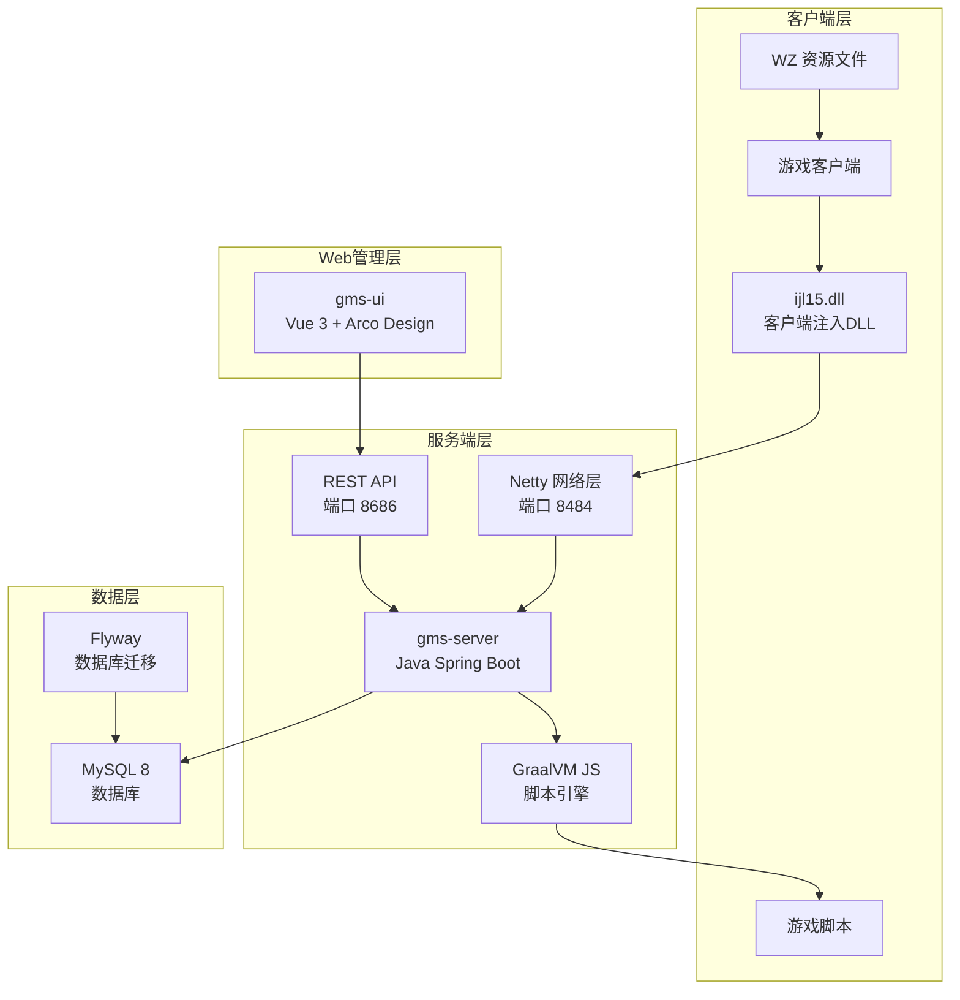
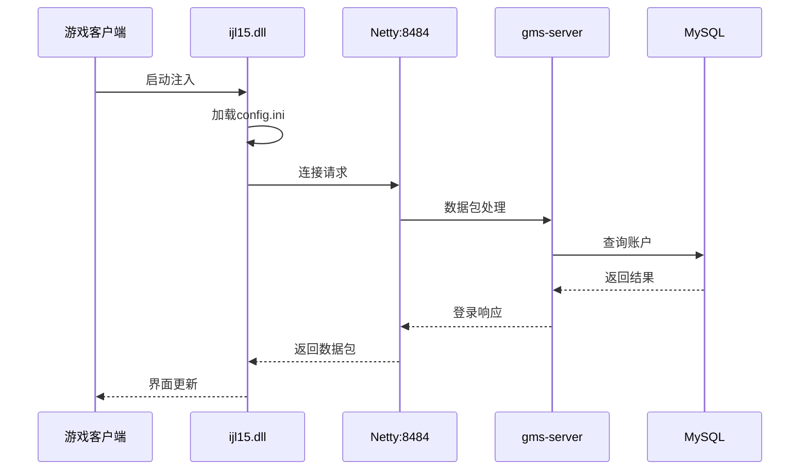
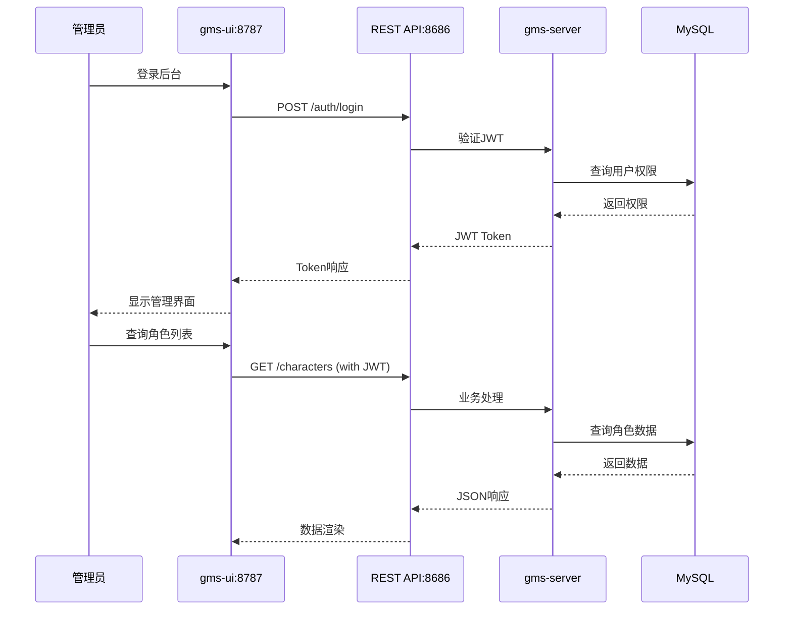

# 架构设计文档

本文档介绍 BeiDou 游戏系统的整体架构设计、技术选型和模块关系。

---

## 目录

1. [系统架构概览](#系统架构概览)
2. [技术栈详解](#技术栈详解)
3. [模块说明](#模块说明)
4. [数据流向](#数据流向)
5. [设计原则](#设计原则)

---

## 系统架构概览

BeiDou 系统采用分层架构，包含客户端层、服务端层、Web管理层和数据层四个主要部分。

### 架构图



### 端口分配

| 端口 | 服务 | 描述 |
|------|------|------|
| 8484 | Netty | 游戏客户端连接端口 |
| 8686 | API | REST API 服务端口 |
| 8787 | gms-ui | Web 前端开发端口 |
| 3306 | MySQL | 数据库端口 |

---

## 技术栈详解

### 服务端技术栈 (gms-server)

| 类别 | 技术 | 版本 | 说明 |
|------|------|------|------|
| 核心框架 | Spring Boot | 3.2.3 | Java 应用框架 |
| Web容器 | Undertow | - | 替代 Tomcat，更轻量 |
| Java版本 | OpenJDK | 21 | LTS 版本 |
| 数据库连接池 | Druid | 1.2.22 | 阿里巴巴高性能连接池 |
| ORM框架 | MyBatis-Flex | 1.8.9 | 轻量级 ORM |
| MySQL驱动 | mysql-connector-j | 8.4.0 | MySQL JDBC 驱动 |
| 网络通信 | Netty | 4.1.109.Final | 高性能网络框架 |
| 脚本引擎 | GraalVM JS | 23.0.4 | JavaScript 执行引擎 |
| API文档 | SpringDoc OpenAPI | 2.5.0 | Swagger UI |
| 安全认证 | Spring Security + JWT | - | 接口认证 |
| 数据库迁移 | Flyway | 9.15.2 | 版本控制迁移 |
| 日志框架 | Log4j2 | - | Spring Boot 默认替换 |
| JSON处理 | FastJSON2 | 2.0.47 | 高性能 JSON 库 |
| 代码简化 | Lombok | 1.18.30 | 减少样板代码 |

### 前端技术栈 (gms-ui)

| 类别 | 技术 | 版本 | 说明 |
|------|------|------|------|
| 核心框架 | Vue | 3.2.40 | 渐进式 JavaScript 框架 |
| UI组件库 | Arco Design | 2.44.7 | 字节跳动设计系统 |
| 构建工具 | Vite | 3.2.5 | 下一代前端构建工具 |
| 状态管理 | Pinia | 2.0.23 | Vue 3 状态管理 |
| 路由 | Vue Router | 4.0.14 | 官方路由库 |
| HTTP客户端 | Axios | 0.24.0 | Promise HTTP库 |
| 国际化 | Vue I18n | 9.13.1 | 多语言支持 |
| 图表 | ECharts | 5.4.0 | 数据可视化 |
| TypeScript | TypeScript | 4.8.4 | 类型安全 |
| Node.js | Node.js | 20.15.0 | 运行环境 |
| 包管理 | Yarn | - | 快速依赖管理 |

### 客户端DLL技术栈 (ijl15)

| 类别 | 技术 | 版本 | 说明 |
|------|------|------|------|
| 开发工具 | Visual Studio | 2019 | Windows IDE |
| 编译器 | MSVC | v142 | VS2019 工具集 |
| 平台 | Windows SDK | 10 | Windows 开发 SDK |
| 构建目标 | x86 | - | 32位 DLL |
| Hook库 | Microsoft Detours | - | API Hook 库 |
| 字符集 | Unicode | - | 支持中文 |

---

## 模块说明

### gms-server 模块结构

```
gms-server/
├── src/
│   ├── main/
│   │   ├── java/org/gms/
│   │   │   ├── ServerApplication.java    # 主入口
│   │   │   ├── config/                   # 配置类
│   │   │   ├── controller/               # REST 控制器
│   │   │   ├── service/                  # 业务服务
│   │   │   ├── entity/                   # 数据实体
│   │   │   ├── mapper/                   # MyBatis Mapper
│   │   │   ├── util/                     # 工具类
│   │   │   └── net/                      # Netty 网络处理
│   │   └── resources/
│   │       ├── application.yml           # 主配置
│   │       ├── db/migration/             # Flyway SQL脚本
│   │       ├── script-zh-CN/             # 中文脚本
│   │       ├── script-en-US/             # 英文脚本
│   │       └── wz-zh-CN/                 # 中文WZ路径
│   │       └── wz-en-US/                 # 英文WZ路径
│   └── test/                             # 测试代码
├── pom.xml                               # Maven配置
```

### 核心组件

#### 1. ServerApplication

服务端主入口，负责：
- 启动 Spring Boot 应用
- 初始化 Netty 网络服务
- 加载配置和脚本

#### 2. Netty 网络层

处理游戏客户端连接：
- 端口：8484
- 协议：自定义游戏协议
- 功能：登录验证、数据包处理

#### 3. REST API层

提供 Web 管理接口：
- 端口：8686
- 认证：JWT Token
- 文档：Swagger UI

#### 4. ScriptEngine 脚本引擎

执行游戏逻辑脚本：
- 技术选型：GraalVM JS（替代原 Nashorn）
- 路径：script-zh-CN / script-en-US
- 功能：NPC对话、任务逻辑、副本脚本

### gms-ui 模块结构

```
gms-ui/
├── src/
│   ├── components/       # 通用组件
│   ├── views/            # 页面视图
│   ├── router/           # 路由配置
│   ├── store/            # Pinia状态管理
│   ├── api/              # API请求封装
│   ├── config/           # 应用配置
│   ├── assets/           # 静态资源
│   ├── locale/           # 国际化语言包
│   └── utils/            # 工具函数
├── config/               # Vite配置
├── package.json          # 项目依赖
```

### ijl15 DLL 模块结构

```
ezorsia/
├── ezorsia.vcxproj       # VS项目文件
├── config.ini            # 客户端配置
├── src/
│   ├── dllmain.cpp       # DLL入口
│   ├── ijl15.cpp         # 主逻辑
│   ├── Memory.cpp        # 内存操作
│   ├── Client.cpp        # 客户端交互
│   ├── FixIme.cpp        # IME修复
│   ├── BossHP.cpp        # Boss血条显示
│   ├── HpMpAlert.cpp     # 血量警报
│   ├── MapleClientCollectionTypes/  # 客户端类型定义
├── out/Release/          # 构建输出
│   └── ijl15.dll
```

---

## 数据流向

### 登录流程



### Web管理流程



---

## 设计原则

### 1. 模块分离

- 游戏网络层 (Netty) 与管理API层分离
- 不同端口处理不同业务
- 客户端DLL独立于服务端

### 2. 版本控制

- API 版本化：v1、v2、v3...
- 数据库版本化：Flyway 迁移脚本
- 配置版本化：application.yml

### 3. 多语言支持

- 脚本路径分离：script-zh-CN、script-en-US
- WZ路径分离：wz-zh-CN、wz-en-US
- 前端国际化：Vue I18n

### 4. 安全设计

- API认证：JWT Token
- 限流保护：可配置IP限流
- 自动封禁：可选开启

### 5. 扩展性

- 脚本驱动：游戏逻辑通过JS脚本实现
- 配置外置：config.ini独立配置
- 插件机制：DLL注入方式扩展客户端

---

## 与原项目的关系

BeiDou 项目基于以下开源项目演进：

| 来源项目 | 说明 | 地址 |
|----------|------|------|
| Cosmic | 汉化和优化基础 | https://github.com/P0nk/Cosmic |
| HeavenMS | 原版服务端 | - |
| Ezorsia | DLL基础框架 | - |

BeiDou 相比原版的改进：

- 客户端DLL：中文输入修复、属性上限突破、Boss血量显示
- 服务端：Spring Boot现代化、Flyway迁移、Swagger文档、多语言
- Web前端：Vue 3 + Arco Design 管理界面

---

## 下一步

- [API接口文档](03-API接口文档.md) - 详细API说明
- [数据库设计文档](04-数据库设计文档.md) - 表结构详情
- [技术规范文档](08-技术规范文档.md) - 开发规范