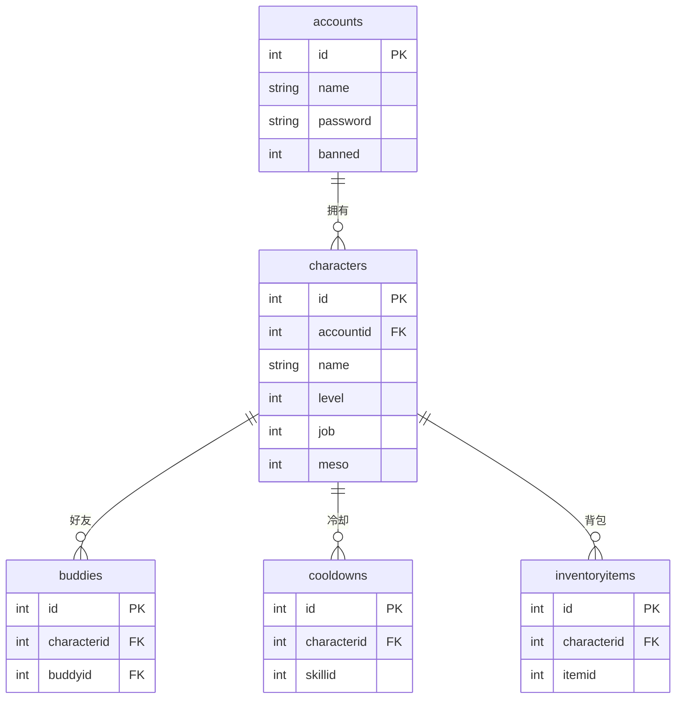

# 数据库设计文档

本文档介绍 BeiDou 服务端数据库的结构设计、表定义和 Flyway 迁移机制。

---

## 目录

1. [数据库概述](#数据库概述)
2. [Flyway迁移机制](#flyway迁移机制)
3. [核心数据表](#核心数据表)
4. [配置相关表](#配置相关表)
5. [游戏数据表](#游戏数据表)
6. [数据库权限](#数据库权限)
7. [数据库管理](#数据库管理)

---

## 数据库概述

### 基本信息

| 项目 | 值 |
|------|------|
| 数据库名称 | `beidou` |
| 数据库版本 | MySQL 8.x |
| 字符集 | UTF-8MB4 |
| 存储引擎 | InnoDB |
| 连接池 | Druid |

### 数据库连接配置

```yaml
mybatis-flex:
  datasource:
    mysql:
      type: com.alibaba.druid.pool.DruidDataSource
      driver-class-name: com.mysql.cj.jdbc.Driver
      url: jdbc:mysql://localhost:3306/beidou?useUnicode=true&characterEncoding=utf-8&useSSL=false&serverTimezone=Asia/Shanghai
      username: root
      password: root
```

### 重要说明

- **不支持 MySQL 8 以下版本**
- 数据库由 Flyway 自动创建和初始化
- 启动服务端前只需确保 MySQL 服务运行即可

---

## Flyway迁移机制

### 概述

BeiDou 使用 Flyway 进行数据库版本管理和迁移，实现：

- 自动创建数据库
- 自动执行初始化 SQL 脚本
- 版本控制数据库变更

### 迁移脚本位置

```
gms-server/src/main/resources/db/migration/
```

### 迁移脚本命名规范

```
V1.x.x__description.sql
```

- `V` - 版本标识（必须）
- `1.x.x` - 版本号（如 V1.0.6、V1.7.0）
- `__` - 双下划线分隔符（必须）
- `description` - 描述说明
- `.sql` - 文件扩展名

### 版本历史概览

| 版本范围 | 主要内容 |
|----------|----------|
| V1.0.x | 核心表创建（accounts、characters、buddies、cooldowns、drop_data等） |
| V1.1.x | 管理员账户更新、扩展值表、现金物品修改表 |
| V1.3.x | 世界属性、服务器属性、HP/MP警报、扭蛋机 |
| V1.4.x | 扭蛋奖励、扭奖池、角色经验日志 |
| V1.5.x | 命令信息表 |
| V1.6.x | 更多游戏数据（商店、物品等） |
| V1.7.x | 游戏配置表、多语言资源表、商店数据 |
| V1.8.x | 游戏配置参数更新 |
| V1.10.x | 自动封禁配置表 |

### Flyway配置

```yaml
spring:
  flyway:
    validate-on-migrate: false  # 禁用版本验证
```

### 迁移执行流程

1. 服务端启动时 Flyway 检查数据库状态
2. 对比 `flyway_schema_history` 表记录
3. 执行未执行的迁移脚本
4. 按版本号顺序依次执行
5. 记录执行结果到历史表

---

## 核心数据表

### accounts（账户表）

存储用户账户信息。

| 字段 | 类型 | 说明 |
|------|------|------|
| id | INT(11) | 账户ID，主键自增 |
| name | VARCHAR(64) | 用户名 |
| password | VARCHAR(128) | 密码（加密存储） |
| salt | VARCHAR(128) | 密码盐值 |
| gender | TINYINT(1) | 性别 |
| banned | TINYINT(1) | 是否封禁 |
| banreason | VARCHAR(256) | 封禁原因 |
| macs | VARCHAR(256) | MAC地址记录 |
| hwid | VARCHAR(256) | 硬件ID |
| lastlogin | TIMESTAMP | 最后登录时间 |
| createdat | TIMESTAMP | 创建时间 |
| nxcash | INT(11) | 点券余额 |

### characters（角色表）

存储游戏角色信息，是核心表之一。

| 字段 | 类型 | 说明 |
|------|------|------|
| id | INT(11) | 角色ID，主键自增 |
| accountid | INT(11) | 所属账户ID |
| world | INT(11) | 所在大区 |
| name | VARCHAR(13) | 角色名称 |
| level | INT(11) | 等级 |
| exp | INT(11) | 经验值 |
| str/dex/luk/int | INT(11) | 四维属性 |
| hp/mp | INT(11) | 当前血量/蓝量 |
| maxhp/maxmp | INT(11) | 最大血量/蓝量 |
| meso | INT(11) | 金币 |
| job | INT(11) | 职业 |
| skincolor | INT(11) | 肤色 |
| gender | INT(11) | 性别 |
| fame | INT(11) | 人气值 |
| hair/face | INT(11) | 发型/脸型 |
| ap | INT(11) | 可分配属性点 |
| sp | VARCHAR(128) | 可分配技能点 |
| map | INT(11) | 当前地图 |
| gm | TINYINT(1) | GM等级 |
| party | INT(11) | 组队ID |
| guildid | INT(10) | 家族ID |
| buddyCapacity | INT(11) | 好友容量 |
| createdate | TIMESTAMP | 创建时间 |
| reborns | INT(5) | 转生次数 |

**索引：**

- PRIMARY KEY (id)
- KEY accountid (accountid)
- KEY party (party)
- KEY ranking1 (level, exp)
- KEY ranking2 (gm, job)
- INDEX (id, accountid, world)
- INDEX (id, accountid, name)

### buddies（好友表）

存储角色好友关系。

| 字段 | 类型 | 说明 |
|------|------|------|
| id | INT(11) | 主键自增 |
| characterid | INT(11) | 角色ID |
| buddyid | INT(11) | 好友角色ID |
| pending | TINYINT(4) | 是否待确认 |
| group | VARCHAR(17) | 分组名称 |

### cooldowns（冷却表）

存储技能冷却状态。

| 字段 | 类型 | 说明 |
|------|------|------|
| id | INT(11) | 主键自增 |
| characterid | INT(11) | 角色ID |
| skillid | INT(11) | 技能ID |
| starttime | TIMESTAMP | 开始时间 |
| length | INT(11) | 冷却时长 |

---

## 配置相关表

### game_config（游戏配置表）

存储服务器游戏参数配置，支持动态修改。

| 字段 | 类型 | 说明 |
|------|------|------|
| id | BIGINT | 自增主键 |
| config_type | VARCHAR(32) | 参数类型 |
| config_sub_type | VARCHAR(32) | 参数子类型 |
| config_clazz | VARCHAR(256) | 参数值Java类型 |
| config_code | VARCHAR(64) | 参数名 |
| config_value | VARCHAR(256) | 参数值 |
| config_desc | VARCHAR(512) | 参数描述 |
| update_time | TIMESTAMP | 最后更新时间 |

**配置类型分类：**

| config_type | 说明 |
|-------------|------|
| world | 大区配置（经验倍率、金币倍率、频道数等） |
| server - Core | 核心服务器配置 |
| server - Game Mechanics | 游戏机制配置 |
| server - Safe | 安全配置 |
| server - Net | 网络配置 |
| server - Debug | 调试配置 |
| server - GM | GM管理配置 |

**常用配置示例：**

```sql
-- 大区配置
('world', '0', 'java.lang.Float', 'exp_rate', '1.0', '经验倍率')
('world', '0', 'java.lang.Float', 'meso_rate', '1.0', '金币倍率')
('world', '0', 'java.lang.Float', 'drop_rate', '1.0', '掉落倍率')
('world', '0', 'java.lang.Integer', 'channel_size', '3', '频道数')

-- 服务器配置
('server', 'Core', 'java.lang.Integer', 'max_channel_size', '20', '最大频道数')
('server', 'Core', 'java.lang.Integer', 'channel_capacity', '100', '频道容量')
```

### lang_resources（多语言资源表）

存储国际化翻译资源。

| 字段 | 类型 | 说明 |
|------|------|------|
| id | BIGINT | 自增主键 |
| lang_type | VARCHAR(32) | 语言类型（zh-CN、en-US） |
| lang_base | VARCHAR(32) | 资源基础类型 |
| lang_code | VARCHAR(128) | i18n编码 |
| lang_value | VARCHAR(512) | i18n值 |
| lang_extend | VARCHAR(512) | 扩展字段 |

**支持语言：**

- `zh-CN` - 中文简体
- `en-US` - 英文

### world_prop（大区属性表）

存储各大区独立配置。

### server_prop（服务器属性表）

存储服务器级别配置。

---

## 游戏数据表

### drop_data（掉落数据表）

存储怪物掉落配置。

| 字段 | 类型 | 说明 |
|------|------|------|
| id | INT(11) | 主键自增 |
| dropperid | INT(11) | 怪物ID |
| itemid | INT(11) | 物品ID |
| minimum_quantity | INT(11) | 最小数量 |
| maximum_quantity | INT(11) | 最大数量 |
| questid | INT(11) | 任务ID |
| chance | INT(11) | 掉落概率 |

### shops（商店表）

存储商店基本信息。

| 字段 | 类型 | 说明 |
|------|------|------|
| shopid | INT(11) | 商店ID |
| npcid | INT(11) | NPC ID |

### shopitems（商店物品表）

存储商店物品配置。

| 字段 | 类型 | 说明 |
|------|------|------|
| shopitemid | INT(11) | 物品ID |
| shopid | INT(11) | 商店ID |
| itemid | INT(11) | 物品ID |
| price | INT(11) | 价格 |
| position | INT(11) | 排列位置 |

### reactordrops（反应器掉落表）

存储地图反应器（箱子）掉落配置。

### gachapon（扭蛋机表）

存储扭蛋机配置。

### gachapon_reward（扭蛋奖励表）

存储扭蛋机奖励物品。

### gachapon_reward_pool（扭奖池表）

存储扭蛋奖励池配置。

### characterexplogs（角色经验日志表）

记录角色经验获取历史。

### command_info（命令信息表）

存储GM命令配置。

### autoban_config（自动封禁配置表）

存储自动封禁规则。

---

## 数据库权限

### 标准权限

MySQL 用户需要以下基本权限：
- SELECT、INSERT、UPDATE、DELETE
- CREATE、ALTER、DROP
- INDEX

### 额外权限要求

如果数据库用户不是 root，需要以下额外权限：

| 权限 | 说明 |
|------|------|
| performance_schema.user_variables_by_thread SELECT | 查询用户变量表 |
| mysql SHOW VIEW | 查看数据库结构 |

### 权限授权SQL

```sql
-- 授权 performance_schema 查询
GRANT SELECT ON performance_schema.user_variables_by_thread TO 'beidou_user'@'localhost';

-- 授权 mysql 视图查看
GRANT SHOW VIEW ON mysql.* TO 'beidou_user'@'localhost';

-- 刷新权限
FLUSH PRIVILEGES;
```

---

## 数据库管理

### 数据库连接池配置

使用 Druid 连接池：

```xml
<dependency>
    <groupId>com.alibaba</groupId>
    <artifactId>druid-spring-boot-starter</artifactId>
    <version>1.2.22</version>
</dependency>
```

### ORM框架

使用 MyBatis-Flex：

```xml
<dependency>
    <groupId>com.mybatis-flex</groupId>
    <artifactId>mybatis-flex-spring-boot3-starter</artifactId>
    <version>1.8.9</version>
</dependency>
```

### 数据库备份

建议定期备份数据库：

```bash
# mysqldump备份
mysqldump -u root -p beidou > beidou_backup.sql

# 恢复备份
mysql -u root -p beidou < beidou_backup.sql
```

### 数据库管理工具

推荐使用：
- DBeaver：https://dbeaver.io/download/
- Navicat Lite：https://www.navicat.com/

### 迁移历史查询

```sql
-- 查询 Flyway 迁移历史
SELECT * FROM flyway_schema_history ORDER BY installed_rank;
```

### 常见表查询示例

```sql
-- 查询在线角色
SELECT c.name, c.level, c.job, a.name as account_name
FROM characters c
JOIN accounts a ON c.accountid = a.id
WHERE a.loggedin = 1;

-- 查询游戏配置
SELECT config_code, config_value, config_desc
FROM game_config
WHERE config_type = 'world' AND config_sub_type = '0';

-- 查询多语言配置
SELECT lang_code, lang_value
FROM lang_resources
WHERE lang_type = 'zh-CN';
```

---

## 表关系图



---

## 下一步

- [配置说明文档](05-配置说明文档.md) - 详细配置参数
- [运维部署文档](06-运维部署文档.md) - 数据库备份策略
- [技术规范文档](08-技术规范文档.md) - 数据库迁移规范